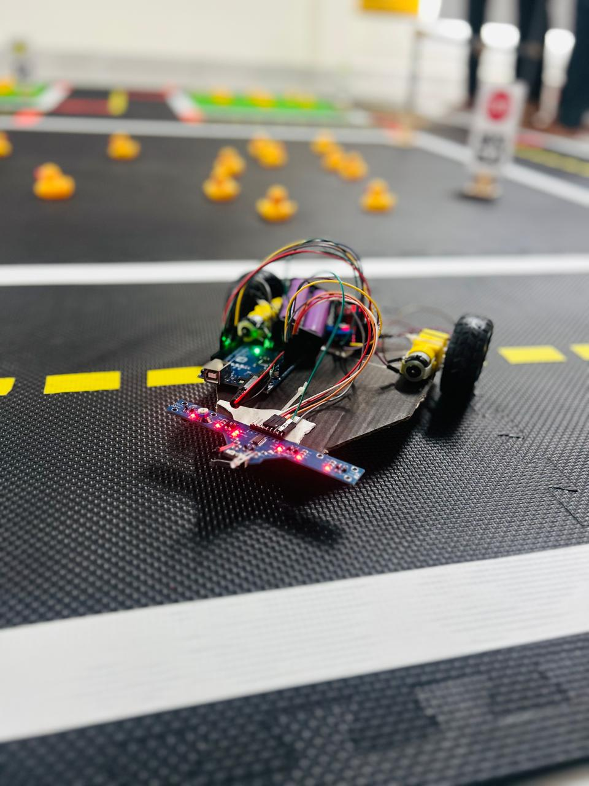

# 🚀 Line Following Robot  

This is an Arduino-based **line-following robot** that follows a **white path** and corrects itself when detecting black.  

## 🖼️ Demo Image  
  
*Figure 1: Line Following Robot following a white path*  

## 🔧 Components Used  
- Arduino Uno  
- L298N Motor Driver  
- 2 DC Motors  
- IR Array Sensor  
- Jumper Wires  

## 📌 How It Works  
✅ Follows a **white path** using an **IR array sensor**  
✅ If it deviates and detects **black**, it **auto-corrects**  
✅ Powered by **Arduino Uno & L298N motor driver**  

